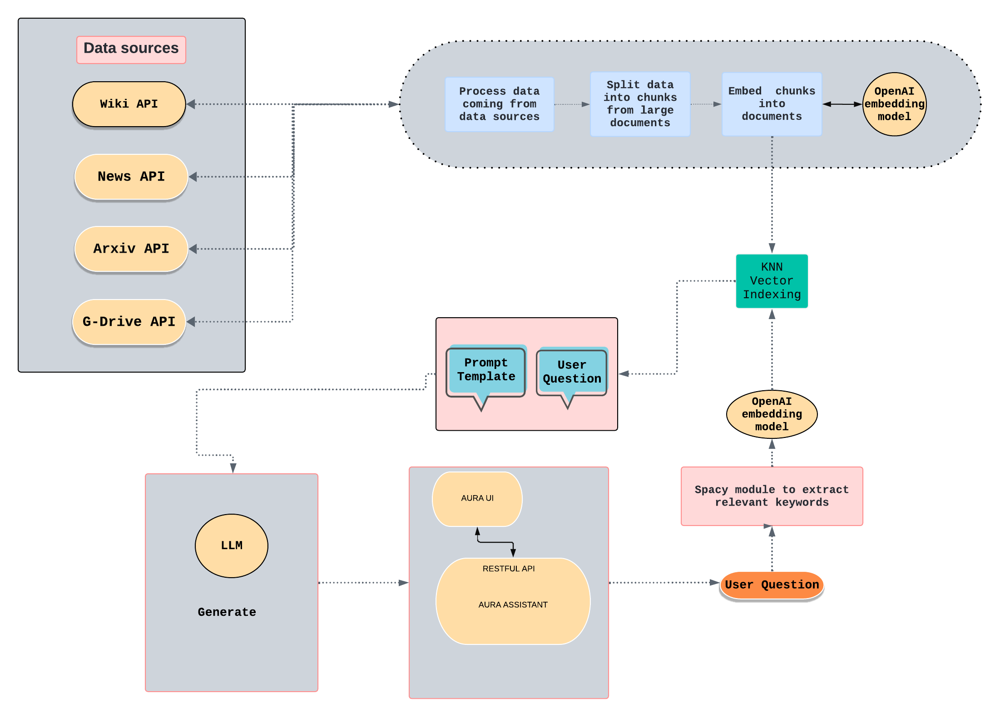
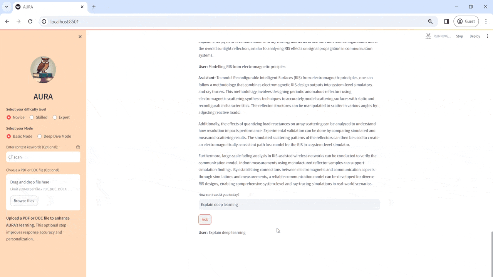
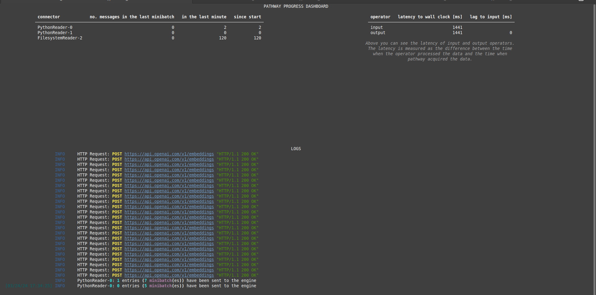

<h1 align="center">
  AURA (Adaptive Understanding and Resource Assistant)
</h1>
<p align="center">
  
</p>
<!-- # AURA (Adaptive Understanding and Resource Assistant) -->

AURA is an innovative assistant designed to revolutionize the way students learn. Harnessing Pathway's cutting-edge LLMApp capabilities, AURA architecturally weaves real-time, Large Language Model-driven data pipelines in Python, amalgamating diverse input sources. It adeptly leverages the OpenAI API, utilizing Embeddings and Chat Completion endpoints to craft dynamic, intelligent responses, setting a new benchmark in AI-assisted learning experiences.

# Revolutionizing Learning with AURA: A New Dawn in Education

## End-user and Impacted Industry

**End-User:** Students, educators, and professionals seeking continuous education and skill development.

**Impacted Industry:** Education and Professional Development


## Business Impact

AURA represents a significant leap forward for educational technology, with wide-ranging implications for business and society:

- **B2B Impact:** AURA can revolutionize corporate training and development, offering personalized learning at scale. Companies can integrate AURA into their training programs, enhancing employee skills more effectively and improving organizational performance.

- **B2C Impact:** Directly available to individual learners, AURA democratizes education, providing personalized learning journeys for users of all ages. This supports a subscription-based revenue model, expanding access to education and fostering a culture of lifelong learning.

- **Social and Economic Contributions:** By making education more accessible and personalized, AURA not only closes the educational gap but also equips the workforce with the skills needed in a rapidly evolving job market. This contributes to economic development and innovation, driving progress and competitiveness on a global scale.


## Key Features

- **Adaptive Learning**: Tailors explanations based on the user's selected difficulty level: Novice, Skilled, or Expert.
- **Rich Content Sources**: Utilizes real-time data syncing from Wikipedia arxiv, news api and data present in Google Drive though pathways real time streaming mode, alongside optional PDF and doc ingestions through upload for deeper insights enabling real-time Retrieval Augmented Generation (RAG).
- **NLP Powered**: Employs Natural Language Processing to extract pivotal keywords from queries, enhancing the relevancy and precision of the information provided. Spacy module is used to extract the relevant keywords.
- **Future Integration**: Plans to incorporate the Wolfram API, enabling AURA to tackle complex mathematical problems.
- **User-Friendly UI via Streamlit**: AURA comes equipped with an intuitive, Streamlit-powered interface, making it effortlessly accessible to users of all skill levels. This sleek, user-friendly UI simplifies navigation, ensuring learners can focus on what matters most: acquiring knowledge seamlessly.
- **Code Reusability**: The code is reusable and all modules are independent of each other.

## Future Enhancements

- **Wolfram API Integration**: To enable solving of complex mathematical problems.
- **Expanded Content Sources**: Incorporate additional databases like kafka redpanda, kafka for a richer learning experience.
- **Document generation**: Generate PDF cantianing query and their answers
- **Real time user statistics**: Show metrics of Active Daily/Weekly Learners, learning Outcome Improvement, time Spent Learning, user Progression Rate:

## DEMO


## Methodolgy
<p align="center">
  
</p>

- **Data Sources**:
    - Real time data is synced from several APIS: Wikipedia, News, Arxiv (a repository of research and academic papers), and Google Drive. The mode used to ingest data into pipeline is streming mode
    - The news API is called every five minute using scheduler and new data are ingested into the pipeline. The news data is stored in jsonline format and ingested into AURA using [llm-app](https://github.com/pathwaycom/llm-app) steaming mode.
    - The Arxiv API and wikipedia API are called to fetch latest data based on the user query maintaing freshness of data. 
    - The Arxuv APi fetches top 15 research papers based on the user query.

- **Streaming Pipeline**:
    - The incoming data from these sources is processed and after processing, the data is split into smaller chunks. This is necessary because it’s often more efficient to work with smaller pieces of text when performing NLP tasks. The changes in data are automatically synced to the pipeline enabling real-time Retrieval Augmented Generation (RAG) using [llm-app](https://github.com/pathwaycom/llm-app) .

- **Embedding**:
    - These chunks are then embedded into a vector space using an OpenAI embedding model. Embedding converts text data into numerical vectors that capture the semantic meaning of the text. 

- **KNN Vector Indexing**:
    - The numerical vectors are indexed using a KNN (k-nearest neighbors) algorithm. In used to quickly retrieve the most relevant text chunks in response to a query based on vector similarity. The AURA is reactive to changes to the corpus of documents: once new snippets are provided, it reindexes them and starts to use the new knowledge to answer subsequent queries. This technique is significantly faster and more efficient than conducting individual comparisons between the query and every document.

- **User Query Processing**:
    - When a user submits a query, a Spacy module is used to extract relevant keywords from the question. Spacy is an open-source software library for advanced NLP.
    - Concurrently, the user's question is also embedded using the same OpenAI embedding model to ensure that the question and the data chunks are in the same vector space.

- **Integration of User Query and Knowledge Base**:
    - The embedded user query is then used to perform a KNN search in the vector index to find the most relevant chunks of embedded data from the processed sources.
    - This combination of user query embeddings and indexed data allows the system to understand and retrieve information that is contextually relevant to the user's question.

- **Response Generation**:
    - The LLM (Large Language Model), uses the retrieved information to generate an appropriate response.
    - The response generation is likely informed by a prompt template, which structures how the model should incorporate the information into a coherent reply.

- **User Interaction**:
    - The generated response is then delivered to the user through an interface, which the diagram labels as "AURA UI".
    - The AURA assistant is the backend service that likely handles the requests from the UI and interacts with the LLM to provide the answers.
    - All communication with the AURA assistant is done through a RESTful API, a common architecture for enabling communication between client and server.

## Usage

- **Select Learning Level:** Users can choose their learning level (Novice, Skilled, Expert) to customize the complexity of the content provided by AURA. This ensures that the learning experience is tailored to the user's current knowledge and skills. We can provide context to.
 - 

 - 
                
- **Upload Documents for In-depth Exploration:** Users have the option to upload PDFs or documents to AURA. This enhances its knowledge base, allowing AURA to draw from a broader range of resources when answering queries or providing educational content.

- **Engage with Queries:** Submit queries to AURA and receive personalized responses. AURA's AI-driven engine analyzes your questions to deliver precise and customized educational content, facilitating a more engaging learning experience.

- **Two Modes of Interaction:** 

    - **Basic Mode:** Offers quick answers and summaries for general queries, suitable for users seeking fast insights.
        

    - **Deep Dive Mode:** Provides detailed explanations and resources, ideal for users looking for an in-depth understanding of a topic.
- 

- **News API:** AURA calls the news API every 5 minutes of each hour using scheduler to update its knowledge base with the latest information and developments. This ensures that the educational content provided is current and relevant. You can refer to the code for more clarification
    ```bash
        ./aura/utils/news_api_connector.py
    ```

- **Enhancing AURA's Learning in Research:** Users can manually call the arXiv API to provide AURA with the latest research papers and articles. Files uploaded this way are automatically ingested into AURA's data pipeline, enriching its resource pool for advanced topics. Future updates to AURA will include automation of API calls for even greater ease of use. Example usage
    ```bash
        python ./utils/arxiv_connector.py  "deep learning"  --max_results 30


## Installation

### A. Run with Docker

### Prerequisites

Ensure you have Docker and docker compose both latest version installed on your system before proceeding. Docker compose  will be used to build and run the application in a containerized environment. For installation please refer the offcial documneation of docker [Docket Installation Guide](https://docs.docker.com/compose/install/linux/)


- **NEWSAPI Key**: The API key for NEWSAPI has been provided. This key is crucial for fetching news data through the NEWSAPI.
- **Google Drive Storage**:
    - Documents uploaded through the UI (PDF, DOC, DOCX formats) will be stored in a specific "data" folder on Google Drive.
    - A secret key for Google Drive API interaction is provided and located within the config folder.
- **OpenAI API Key**:
    - Create an [OpenAI](https://openai.com/) account and generate a new API Key: 
    - To access the OpenAI API, you will need to create an API Key. You can do this by logging into the [OpenAI] (https://openai.com/product) website and navigating to the API Key management page.


### 1. Environment Setup

1. Create a `.env` file in the root directory of your project.
2. Add the following lines to the `.env` file, replacing `{OPENAI_API_KEY}` with your actual OpenAI API key:

   ```env
   OPENAI_API_KEY={OPENAI_API_KEY}
   PATHWAY_REST_CONNECTOR_HOST=backend
   PATHWAY_REST_CONNECTOR_PORT="8080"
   NEWS_API_KEY="5635b529b43446868b7e7b6ec97fecab"
   ```

This file will be used by Docker to set the environment variables inside the container.

### 2. Build and Run the Docker Image

With the environment variables set up, you can now build the Docker and run the image for the project.

- Open a terminal or command prompt.
- Navigate to the root directory of your project.
- Execute the following command to build and run the docker:

  ```sh
  docker compose up
  ```

This step compiles your application and its dependencies into a Docker image.


### 3. Access the Application

- Open your web browser.
- Navigate to `localhost:8501` to access the application.

You should see the application's interface if the setup was successful. This confirms that your Docker container is running and the application is accessible.

### 4. Troubleshooting

If you encounter any issues during the setup or execution process, please check the following:

- Ensure Docker is running on your system.
- Verify that the `.env` file contains the correct API key and settings.
- Make sure the Docker image was built successfully without errors.
- Check if the Docker container is running and the ports are correctly mapped.

For further assistance, consult the Docker documentation or seek help from Docker community forums.

### B. Run with Conda

### Prerequisites

Ensure you have Conda installed on your system before proceeding. Conda will be used to create an environment and run the application with all the required dependencies. If you don't have Conda installed, please follow the official [Conda Installation Guide](https://docs.conda.io/projects/conda/en/latest/user-guide/install/index.html).

### Setting Up the Environment

1. Clone the project repository to your local machine.
    ```
    git clone repo
    ```
2. Navigate to the project directory.
    ```
    cd AURA
    ```

3. Set environment variables

    Create .env file in the root directory of the project, copy and paste the below config, and replace the {OPENAI_API_KEY} configuration value with your key.

    ```env
    OPENAI_API_KEY={OPENAI_API_KEY}
    PATHWAY_REST_CONNECTOR_HOST=0.0.0.0
    PATHWAY_REST_CONNECTOR_PORT="8080"
    NEWS_API_KEY="5635b529b43446868b7e7b6ec97fecab"
   ```

3. Create a new Conda environment with the required dependencies:

    ```bash
    conda create --name myenv python==3.10
    ```

    Replace `myenv` with a name of your choice for the Conda environment.

4. Install dependencies
   ```
   pip install -r requirements.txt
   ```

5. Activate the newly created Conda environment:

    ```bash
    conda activate myenv
    ```

6. Run the Backend Server:

    ```bash
    python main.py
    ```
    <p align="center">
    
    </p>


7. Launching the Streamlit UI for AURA user interface:
    ```bash
    streamlit run ./ui/server.py
    ```
  - Open your web browser.
  - Navigate to `localhost:8501` to access the application.


